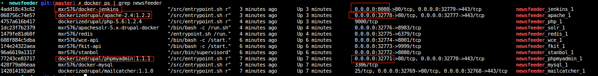

# NewsFeeder
### Opensource toolkit for data mining on news feeds

The **NewsFeeder** is a Drupal 7 based Drupal distribution which sharpened to be a kick-starter for importing-, processing and visualizing the content of RSS/Atom feeds.
The default install profile install and set up only the necessary Drupal modules, but if you just would like to try the features of this distribution, then I'd like to suggest you to meanwhile the installation process select the NewsFeeder Demo & NewsFeeder Development features as well.

If you would like to see the real power of the NewsFeeder, please click to the following link: societalsecurity.net/media-watch


## Importing

The project uses the [Feeds](https://www.drupal.org/project/feeds) Drupal module for importing the content of the RSS/Atom feeds.


## Processing

(Post)processing of the imported feed items is the most important feature of this project. Usually, every feed item's description field contains only the teasers of the original content and because of this we need to import the full/original content of each feed items separately. To make this work I've created two things:
* A Drupal module, called Feed Enhancer, which is able to execute tasks in the provided order on the imported feed items in the background. In this case "the background" means queues in the Drupal terminology. One of these so called "enhancers" is the Full Content enchancer, which communicates with a Node.js based REST API to retrieve the original content of the imported feed items.
* A Node.js module, called Webpage Content Extractor API ([wce-api](https://www.npmjs.com/package/wce-api)), which is able to extract the content of any webpage by uses various readability algorithms.

When you install the NewsFeeder with enabled Demo & Devel features, then you get some other "enhancers" as well. You can see and manage them on the [admin/structure/feeds/feed_importer/feed-enhancer](__screenshots/feed_enhancer_ui_with_descriptions.png) path. Your selected order here will determine the order of the executed enhancers' order after each feed source import on the imported feed items.


## Visualizing

The project uses the Apache Solr as a search engine. Each "enhanced" feed item is automatically indexed with it and you can search among them on a custom search page. The search page is built on the combination of the [Search API](https://www.drupal.org/project/search_api) + [Search API Solr](https://www.drupal.org/project/search_api_solr) and [Facet API](https://www.drupal.org/project/facetapi) Drupal modules. After you provided some search criteria then you can see a map and a graph above the search results, which currently built on top of the [Apache Solr](https://www.drupal.org/project/apachesolr) Drupal module and queried plus rendered programmatically to prevent performance issues caused by the Search API Solr.


## HOW-to-USE

If you are familiar with [Docker](https://www.docker.com) and [Docker Compose](https://docs.docker.com/compose/) then nothing could be simpler. You can create a complete development environment for the project with one command.

Just clone this repository and create a complete development environment with:

 ```sh
 docker-composer -f docker-compose.demo.yml up -d
 ```

This command will start all necessary containers for a Demo installation of this project. After all containers are successfully started, then you should see something similar to this, if you execute the `docker ps | grep newsfeeder` command:



As you can see, the Apache's port is dynamically mapped to the host, so you'll need to execute this command every time to find out the current port of the Apache on your host system. So in this case you can reach the NewsFeeder on the http://localhost:32778 address in your favored browser.

If you install the project with enabled NewsFeeder Demo features, then you'll see two links in the left sidebar: Import feed sources and Import keywords. I'd like to suggest you to visit these links and import some sample data for testing.

You'll also get a PHPMyadmin and a Jenkins as well by using this Docker Compose file. The Jenkins is necessary for automatic execution of the background tasks (see above, "enhancers"). After the first startup of the project you'll need to import the pre-configured settings for the Jenkins by navigating to the `__docker/docker-jenkins/tools` path and executing the `./jenkinsdata.sh restore` command<sup> __*__ </sup>. After that, you'll need to restart the Jenkins container with `docker restart newsfeeder_jenkins_1` command. When to container successfully restarted, then you can access to the configured Jenkins on the http://localhost:8080 address and login with the container/container user and password.


<sup> __*__ </sup> Because Github does not play well with files which bigger than 100mb, I had to remove the backed up configuration from the repository. You can download it from [here](http://biczodezso.hu/sites/default/files/newsfeeder_jenkins-data_1.tar.gz) and please save it to the `__docker/docker-jenkins/tools` folder before you execute to restore command.

## Highlighted features

 1. It is able to import the full/original content of each feed items with the help of the WCE-API Node.js module.
 2. It can execute addition background tasks on each imported feed items automatically. You can create new tasks easily by implementing the `FeedItemEnhancerPluginInterface` interface or by extending the `NodeFeedItemEnhancerPlugin` class.
 3. The imported feed items are automatically indexed with Apache Solr.
 4. The geolocation information from the feed items (extracted by the [Apache Stanbol's Enhancer component](https://stanbol.apache.org/docs/trunk/components/enhancer/)) can be displayed on maps, based on the search results.
 5. The frequency of the provided keywords and the selected facet filters can be displayed on graphs.


## PS.

This project was the topic of my [master thesis](http://biczodezso.hu/sites/default/files/diplomamunka.pdf) at the University of Szeged in January of 2016. I'd like to say thank you for the @Pronovix, because this project's idea stem from a work project and they gave me support to make this happened.

## TODOs

- [ ] Finish the Feed Enhancer UI's implementation for feed source based overrides as well. (Publish it to D.o. as a contrib.)
- [ ] Replace Apache Solr module with the Solarium library. (Maybe Search API as well.)
- [ ] ...


## Licence
GNU General Public License v2.0 (GPL-2.0)
